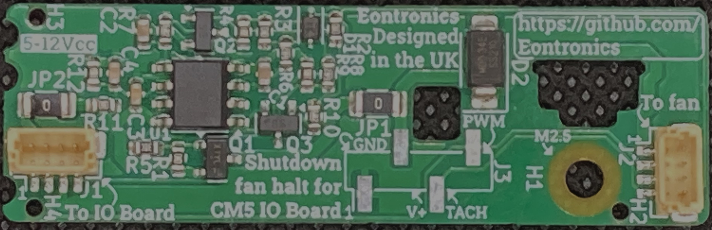

# CM5 IO Board Fan Halt
A small, low cost add-on module for the Raspberry Pi Compute Module 5 IO Board to halt the fan from spinning after shutting the Pi down!
Development logs of the hardware can be found on the [Hackaday.io project page](https://hackaday.io/project/202403-cm5-io-board-fan-halt).

## What is it for?
After shutting down the Raspberry Pi Compute module 5, the fan control PWM signal is allowed to float high. 
As a result, the fan ramps up to full speed after turning everything else off, and the only way to stop it is to unplug the power.
Annoying!

This module can be attached directly to the Compute Module 5 IO board, and electrically sits betwween the fan header and the fan.
When it detects the Pi has been shutdown, it also automatically cuts power to the fan to keep it from spinning up and making noise.

## How does it work?
The module monitors the voltage on he 'CM5_3.3V' rail of the Compute Module 5 to determine whether it is an active or shutdown state.
Conveniently, this rail drives the pullup resistor on the 'Fan_Tacho' pin, so it is possible to monitor it through the fan header.

By monitoring how long it has been since this pin was pulled high, it can detect whether 'CM5_3.3V' is powered, while ignoring brief
'low' pulses that occur when the signal is pulled down through the fan tachometer. This then drives a high side transistor to either
provide or cut power to the fan.

## Show me that it works!
Don't just take my word for it, I've linked a short video [here](https://www.youtube.com/watch?v=HvpnCyq3iTY) to demonstrate that the module does what it's supposed to do!
